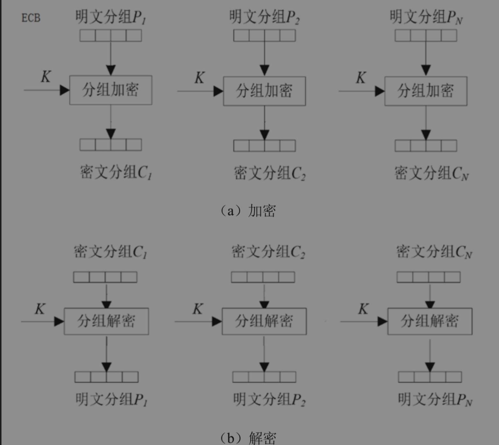
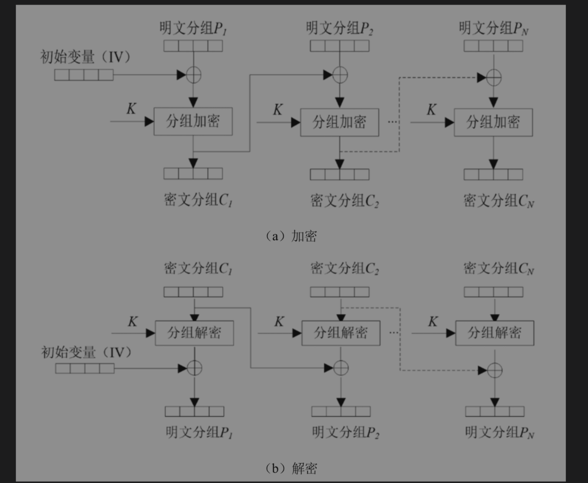
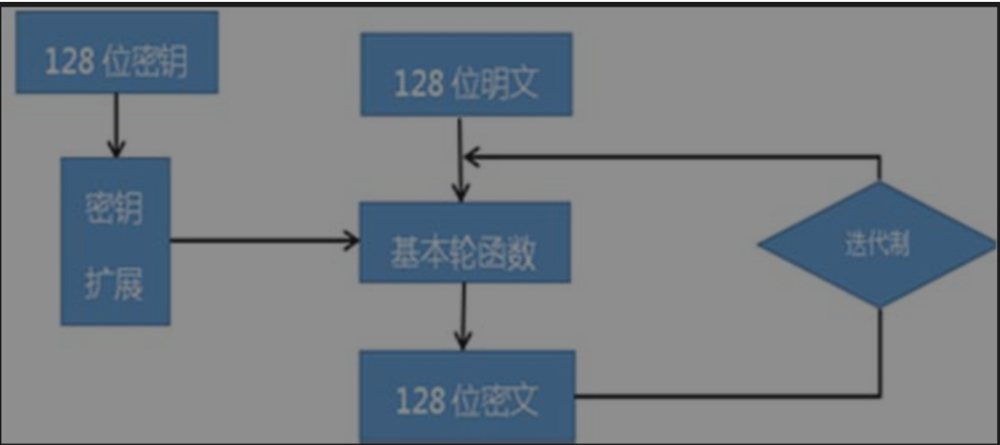

# cipher
java encrypt and decrypt password.for explame aes/des/sm3/sm4

# 密码学和java
加密技术是最常用的安全保密手段，利用技术手段把重要的数据变为乱码（加密）传送，到达目的地后再用相同或不同的手段还原（解密）。加密技术可以分为两类，即对称加密技术和非对称加密。对称加密的加密密钥和解密密钥相同，常见的对称加密算法有DES、AES、SM1、SM4等；非对称加密又称为公开密钥加密技术，它使用一对密钥分别进行加密和解密操作，其中一个是公开密钥(Public-Key)，另一个是由用户自己保存（不能公开）的私有密钥(Private-Key)，通常以RSA、ECC算法为代表。

### 对称算法加密
常用的对称算法有DES、3DES、TDEA、Blowfish、RC2、RC4、RC5、IDEA、SKIPJACK、AES，以及国家密码局颁布的SM1和SM4等算法。

##### 分组加密工作模式
分组加密算法又称块加密算法，就是一组一组进行加解密。它将明文分成多个等长的块（block，或称分组）
1. ECB模式：每个分组都使用相同的密钥进行加密，这种模式在加密数据时，对明文分组进行加密，然后对密文分组进行解密，所以称ECB模式。

2. CBC模式: 每个分组都与前一个分组的密文异或后再加密，解密时，将密文与前一个分组的密文异或后再解密。有向量IV。

###### DES加密
DES（Data Encryption Standard，数据加密标准）是由IBM公司研制的一种对称算法，也就是说它使用同一个密钥来加密和解密数据，并且加密和解密使用的是同一种算法

DES算法是分组算法，每组8字节，加密时一组一组进行，解密时也是一组一组进行。
###### sm4加密
SM4分组密码算法在使用上表现出了安全高效的特点，与其他分组密码相比较有以下优势。

(1)算法资源利用率高，表现为在密钥扩展算法与加密算法上可共用。

(2)加密算法流程和解密算法流程一样，只是轮密钥顺序相反，因此无论是软件实现还是硬件实现都非常方便。

(3)算法中包含异或运算、数据的输入输出、线性置换等模块，这些模块都是按8位来进行运算的，现有的处理器完全能处理。

SM4分组密码算法主要包括加密算法、解密算法以及密钥的扩展算法三部分：

###### 利用JCA/JCE对称加解密
加密技术是最常用的安全保密手段，利用技术手段把重要的数据变为乱码（加密）传送，到达目的地后再用相同或不同的手段还原（解密）。加密技术可以分为两类，即对称加密技术和非对称加密。对称加密的加密密钥和解密密钥相同，常见的对称加密算法有DES、AES、SM1、SM4等；非对称加密又称为公开密钥加密技术，它使用一对密钥分别进行加密和解密操作，其中一个是公开密钥(Public-Key)，另一个是由用户自己保存（不能公开）的私有密钥(Private-Key)，通常以RSA、ECC算法为代表。JCA对这两种加密技术都支持。这里先介绍对称加解密。

Java加密体系框架(JCA)包括一个提供者架构以及数字签名、消息摘要、认证、加解密、密钥生成与管理、安全随机数产生等一系列API接口。它本身不负责算法的具体实现，任何第三方都可以提供具体的实现并在运行时加载。这些API接囗使得开发者可以方便地将安全集成到应用程序中。JDK中的其他加密通信库很多使用了JCA提供者架构，包括JSSE、SASL、JGCA提供的核心类和接囗：(1)类Provider和Security，这是基础。(2)密钥接口Key，是安全的核心。(3)SecureRandom、MessageDigest、Signature、Cipher、Mac、KeyFactory、SecretKeyFactory、KeyPairGenerator、KeyGenerator、KeyAgreement、AlgorithmParameters、AlgorithmParameterGenerator、KeyStore、CertificateFactory、engine classes都是随机数、加密、摘要、签名或密钥协商等的类，主要是面向开发者，这些类分别在包java.security和包javax.crypto中.
1. AES：AES算法是分组加密算法，每组16字节，加密时一组一组进行，解密时也是一组一组进行。
   KeyGenerator自动生成秘钥但是需要seed，直接用New SecretkeySpec(),需要原始秘钥。参考：AesUtils
2. Sm4: SM4算法是分组加密算法，每组16字节，加密时一组一组进行，解密时也是一组一组进行。
参考：SM4Util

### 杂凑函数和HMAC（摘要算法）
既然有了新称呼“摘要算法”，那就用摘要算法好了，没必要再去套加密的概念，因为说到加密，通常都会自然而然想到解密，既然摘要算法没有解密，就没必要去和加密这个概念混淆了。一个摘要算法就能讲清楚该算法的本质，即不可逆。

杂凑函数（又叫Hash函数、哈希函数、消息摘要函数、散列函数）就是把任意长的输入消息串变化成固定长的输出串的一种函数。杂凑函数是信息安全中一个非常重要的工具，对一个任意长度的消息m施加运算，返回一个固定长度的杂凑值h(m)，杂凑函数h是公开的，不用对处理过程保密。杂凑值也被称为哈希(Hash)值、散列值、消息摘要等.

一个安全的杂凑函数应该至少满足以下几个条件：

(1)输入长度是任意的。

(2)输出长度是固定的，根据目前的计算技术应至少取128bit，以便抵抗生日攻击（生日攻击是一种密码学攻击手段，所利用的是概率论中生日问题的数学原理）。

(3)对每一个给定的输入，计算输出（杂凑值）是很容易的。

(4)给定杂凑函数的描述，找到两个不同的输入消息杂凑到同一个值是计算上不可行的，或给定杂凑函数的描述和一个随机选择的消息，找到另一个与该消息不同的消息使得它们杂凑到同一个值是计算上不可行的。
###### 杂凑函数分类
1.不带密钥的杂凑函数

不带密钥的杂凑函数在运算过程中没有密钥参与。不带密钥的杂凑函数的杂凑值只是消息输入的函数，无须密钥就可以计算。因此，这种类型的杂凑函数不具有身份认证功能，仅提供数据完整性检验，如篡改检测码(MDC)。按照所具有的性质，MDC又可分为弱单向杂凑函数(OWHF)和强单向杂凑函数(CRHF)，比如SM3就是不带密钥的杂凑函数

2.带密钥的杂凑函数

带密钥的杂凑函数在消息运算过程中有密钥参与。这类杂凑函数需要满足各种安全性要求，其杂凑值同时与密钥和消息输入相关，只有拥有密钥的人才能计算出相应的杂凑值。带密钥的杂凑函数不仅能够检验数据完整性，还能提供身份认证功能，被称为消息认证码(MAC)。消息认证码的性质保证了只有拥有秘密密钥杂凑函数的人，才能产生正确的消息：MAC对。后面HMAC一节我们将重点阐述。
###### SM3消息摘要算法
1.引入bcprov-jdk18on jar包
2.参考SM3Util
###### MD5消息摘要算法
摘要类MessageDigest是包java.security中的类。参考：MD5Util
### 非对称算法RSA的加解密
非对称加密为数据的加密与解密提供了一个非常安全的方法，使用一对密钥：公钥(public key)和私钥(private key)。私钥只能由一方安全保管，不能外泄，而公钥则可以发给任何请求它的人。非对称加密使用这对密钥中的一个进行加密，而解密则需要另一个密钥。

##### 基于JCA的RSA算法实现
参考:RSAUtils